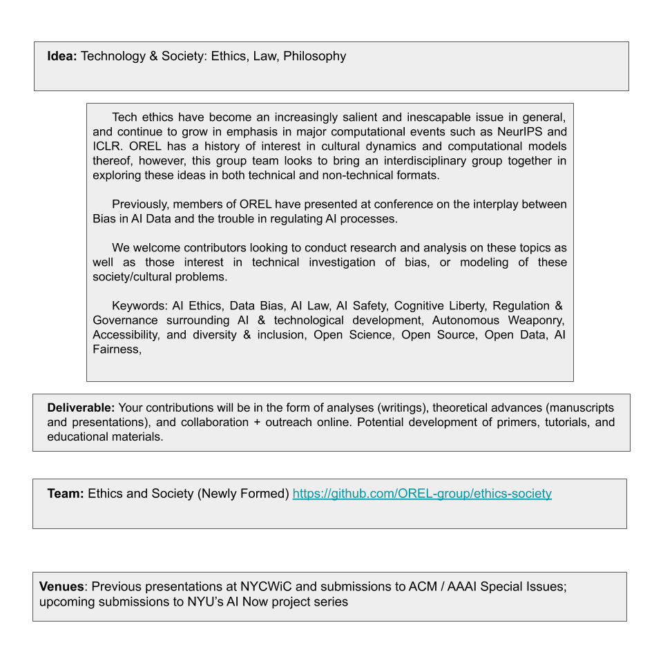

# OREL Ethics & Society Team
*A new Orthogonal Research & Education Lab - Ethics &amp; Society, focusing on AI Ethics, society-tech issues, law, programming ethics, and dovetails into fairness &amp; interpretability / explainability*

### Current Project: NYCWiC '21 (Accepted!) AI Ethics Presentation, and AI Now's AI Lexicon

Latest Update: NYCWiC accepted presentation is in the works, but the Ethics Team at my lab itself has a variety of projects on this topic. 1) NYCWiC presentation, 2) Submissions to AI Now's AI Lexicon short essays call for involvement, 3) Manuscript - eventual development into much broader, refined paper. We are not AI Ethics Experts, but we can engage in cross-disciplinary team work in way befitting of operating within AI Ethics endeavors. 

#### AI Ethics Presentation: Call for Involvement
[GitHub Project Board](https://github.com/orgs/OREL-group/projects/6) | [NYCWiC '21](www.nycwic.org/) | Current Project Details: AI Ethics Frameworks Short Persentation 

- ~15 minute presentation at NYCWiC (Accepted! Our (pre-recorded?) presentation will air April 9)
- [Preliminary Abstract](https://github.com/OREL-group/ethics-society/blob/main/Proposals/NYCWiC-2021.md#abstract-submission): "Towards a Sufficient Unified Ethical Framework for AI: Challenges & Opportunities"
- Approach: Overview, with specific emphasis on selected topics in AI Ethics
- Involvement/Time commitment minimum: in the next month (Due ~ April 5), read materials and contribute to at least one slide / 60 seconds of presentation (there are several opportunities for greater involvement)
- Method: Discussions in Slack & email, shared google doc for some notes, collaborative work on slides
- Deliverable: Presentation slides, and at minimum sufficient notes to explain them, if not actually you presenting your area of focus yourself 

##### Questions for YOU
- **What area of focus are you interested in?** (There are some broad categories below, but the specifics of our presentation will depend on contributors. 
- **Involvement level?** This project is intentionally collaborative and open. However, if you are interested in fleshing out these topics more, beyond the narrow scope of the presentation at NYCWiC, there are opportunities to contribute to / develop topical essays to another venue's submissions, as well as a broader manuscript to go much more in-depth at a holistic level. However, the presentation at NYCWiC is nice, because it affords people from different backgrounds  an opportunity to work together, even without being 'ai ethics experts', and get experience at cross-discipline collaboration befitting much of the work necessary in AI Ethics itself. 

##### Focus Areas
- Algorithim Auditing
- Existing Ethical Frameworks - Comparative Analysis of Current 
- "FAT" Fairness - Accountability - Transparancy
  - Interpretatbility & Explainability
- Bias and "Neutraliy" - Critical Analaysis
- Moral Theory & Philosphical Underpinnings
- AI Safety vs AI Ethics
- ... with room for your specific interests! [Comment on a GitHub Issue - or make your own](https://github.com/orgs/OREL-group/projects/6)

### Resources
- [GitHub Project Board](https://github.com/orgs/OREL-group/projects/6) | [NYCWiC '21 Homepage](www.nycwic.org/) | [Previous NYCWiC Submissions](https://www.researchgate.net/publication/339813839_Bridging_the_Gap_An_Interdisciplinary_Examination_of_Implementing_AI_Ethics)
- [Medium Post on Ethics Team](https://medium.com/orel-group/society-ethics-team-nycwic-lab-news-smn-21-02-06-504ce6151366)
- [Discussion of Background in Saturday Morning Neurosim (Feb 2)](https://www.youtube.com/watch?v=bUQDJJ6ABpM&lc=UgzgzUGNV8qOakUV0Z94AaABAg) (See Jesse's Comment for Timestamps)
- [Ethics Team Zotero Library (Public)](https://www.zotero.org/groups/2574810/orel/collections/AQ63PAPK)

### Contact
Reach out to [Jesse on Twitter](https://twitter.com/JesParent) or OREL Slack - or leave a comment / issue here on GitHub!

# Fancy Ethics Team Image Below~~

